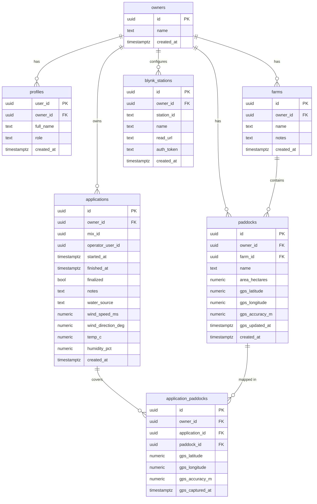

diff --git a/docs/DesignBrief.md b/docs/DesignBrief.md
index 667956ad655e1cca32d955feb4527679445d7eec..74ab103420df2349a325a79b961f93446a926b35 100644
--- a/docs/DesignBrief.md
+++ b/docs/DesignBrief.md
@@ -1,58 +1,66 @@
+## System Architecture Overview
+The mobile-first PWA captures spray applications and coordinates with a FastAPI backend and Supabase data store. Client-side modules handle authentication, GPS capture, and provisional PDF generation while delegating authoritative storage, weather retrieval, and final PDF rendering to backend services. Supabase enforces owner-scoped security through row-level policies and integrates with external weather webhooks.
+
+```mermaid
 flowchart LR
   subgraph Client [PWA: Next.js 14 (TS, Tailwind)]
     UI[Records + Admin UI]
     GPS[Geolocation API]
     Auth[Supabase Auth (JWT)]
     jsPDF[Provisional PDF (offline)]
   end
 
   subgraph Backend [FastAPI @ Render (Docker)]
     API[/REST: /api/*/]
     PDF[WeasyPrint PDF Export]
   end
 
   subgraph Data [Supabase (Postgres + RLS)]
     T1[owners, profiles]
     T2[farms, paddocks]
     T3[mixes, mix_items]
     T4[applications, application_paddocks]
     T5[blynk_stations]
   end
 
   subgraph Weather [Blynk]
     WX[(Webhook endpoint)]
   end
 
   UI -->|JWT via Auth| API
   GPS --> UI
   jsPDF ---> UI
   API <--> Data
   API --> PDF --> UI
   API --> WX
+```
 
+## Data Relationships
Owner-scoped tables capture user profiles, farms, paddocks, spray applications, and related telemetry. Each record mirrors the SQLAlchemy models in `apps/backend/app/models.py`, ensuring GPS, weather, and metadata columns stay in sync with the backend schema.



## End-to-End Workflow
+A typical spray record flows from paddock selection and GPS capture through weather enrichment, finalization, and PDF export. The sequence below shows how the frontend coordinates with FastAPI services, Supabase, and the Blynk weather webhook to deliver audit-ready records.
 
-  sequenceDiagram
+```mermaid
+sequenceDiagram
   participant U as User (PWA)
   participant FE as Next.js Frontend
   participant BE as FastAPI API
   participant DB as Supabase (RLS)
   participant WX as Blynk
 
   U->>FE: Select paddocks + Capture GPS per paddock
   FE->>BE: POST /api/applications (JWT / Dev headers)
   BE->>DB: insert application + application_paddocks
   DB-->>BE: application_id
   BE-->>FE: { application_id }
 
   U->>FE: Fetch Weather
   FE->>BE: POST /api/weather/fetch?station_id&application_id
   BE->>WX: GET webhook with API key
   WX-->>BE: { wind_ms, wind_deg, temp_c, humidity_pct }
   BE->>DB: update application weather
 
   U->>FE: Finalize
   FE->>BE: POST /api/applications/:id/finalize
   BE->>DB: set finalized, finished_at
 
   U->>FE: View PDF
   FE->>BE: GET /api/applications/:id/export.pdf
   BE->>DB: load application + paddocks + mix items
   BE->>BE: WeasyPrint render (with QR, watermark)
   BE-->>FE: PDF
+```
+
+## Acceptance Criteria
+- Tank mix builder allows selection of chemicals and water quantities with Supabase persistence for mixes and mix items.
+- Owners can administer farms and paddocks, with GPS capture stored per paddock and validated against boundaries.
+- Weather snapshots captured via Blynk webhook populate wind, temperature, and humidity for each application.
+- Final audit PDF is generated server-side with QR code and watermark, while an offline provisional PDF remains available in the PWA.
+- Supabase row-level security ensures owner-scoped access across all records and authenticated sessions via Supabase Auth.
 
+## Project Milestones
+1. **Scaffold Complete** — Backend, frontend, and Supabase migrations in place to support core workflows.
+2. **Weather Integration & Finalize UX** — Connect weather fetch endpoint, surface finalize button in the UI, and ensure application finalization triggers PDF generation.
+3. **QA Audit Readiness** — Execute QA pass covering GPS accuracy, weather capture, mix management, and PDF outputs to validate readiness for audits.


